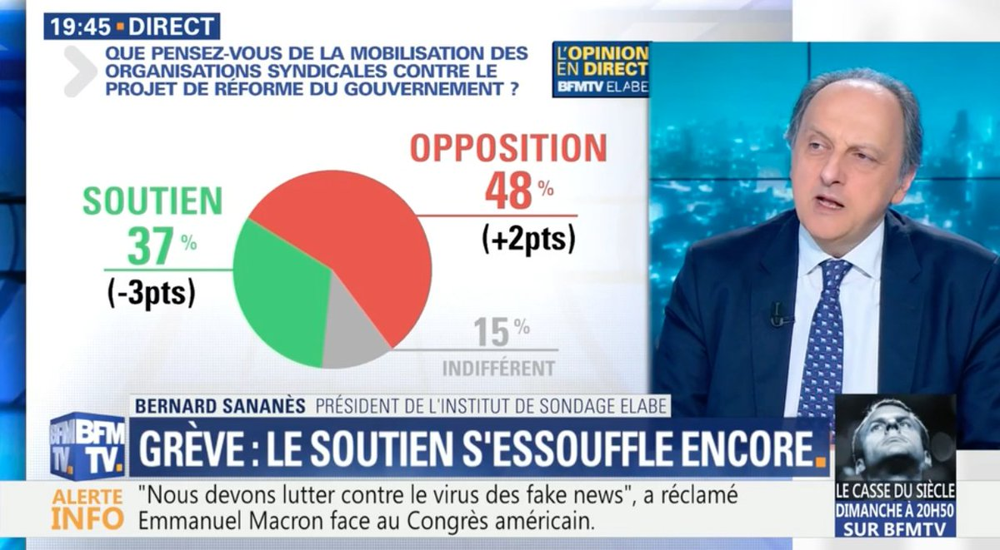
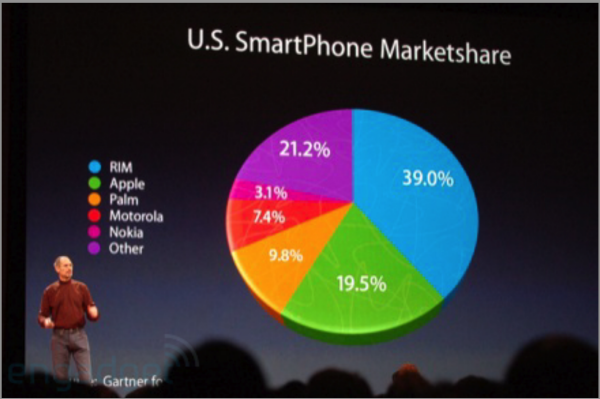

Première image

Cette image est une capture d’écran de BFM TV présentant un sondage sur la mobilisation syndicale contre un projet de réforme du gouvernement. 
Le graphique indique 48 % d’opposition, 37 % de soutien et 15 % d’indifférence, des chiffres qui totalisent bien 100 %. 
Cependant, la représentation en camembert semble déformer les proportions réelles : la partie rouge paraît occuper une place beaucoup plus importante que les 48 % annoncés, tandis que la partie verte semble sous-représentée par rapport aux 37 %. 
Cette erreur de représentation peut donc donner au téléspectateur l’impression que l’opposition est beaucoup plus écrasante qu’elle ne l’est réellement, alors que l’écart entre opposition et soutien est de seulement 11 points. 
La mise en forme renforce également cette impression avec le rouge très visible et le titre « Grève : le soutien s’essouffle encore », qui oriente la manière dont le public interprète les résultats. 
L’image montre ainsi que, même lorsque les chiffres sont corrects, la manière de les représenter et de les commenter peut déformer la perception de l’information.

Deuxième image

Cette image présente un graphique en barres comparant deux pourcentages : 33,9 % le 03-avril et 29,7 % le 04-avril. Les chiffres montrent une différence assez faible de 4,2 points, soit environ 14 % de plus pour le 3 avril. 
Pourtant, la représentation graphique exagère fortement cette différence : la barre turquoise de 33,9 % est visuellement plus de deux fois plus haute que la barre violette de 29,7 %, alors qu’elle ne devrait être que légèrement plus haute. 
Si les hauteurs étaient proportionnelles aux valeurs, la barre de 33,9 % devrait mesurer seulement environ 14 % de plus que celle de 29,7 %. 
Ici, le graphique donne donc une impression de différence beaucoup plus importante que la réalité. 
C’est un exemple de déformation de l’information par la visualisation des données : les pourcentages écrits sont corrects, mais l’échelle graphique est trompeuse et peut influencer la perception du lecteur.

Troisième image 

Cette image présente un camembert intitulé « U.S. Smartphone Marketshare », censé montrer la répartition du marché américain des smartphones entre plusieurs marques : RIM (39 %), Apple (19,5 %), Palm (9,8 %), Motorola (7,4 %), Nokia (3,1 %) et les autres (21,2 %). Pourtant, cette infographie est trompeuse visuellement : les proportions ne sont pas représentées de manière fidèle, notamment parce que l’effet en 3D, les ombres et la perspective donnent l’impression que certaines parts sont beaucoup plus grandes ou plus petites qu’elles ne le sont réellement. 

Par exemple, la part de 39 % paraît disproportionnée par rapport à celle de 21,2 %, alors que l’écart réel est bien moins spectaculaire. De plus, les couleurs, la taille des secteurs et la perspective peuvent influencer notre perception et nous faire interpréter les données autrement que si elles étaient présentées dans un graphique en 2D simple.
Cette image montre donc qu’une infographie peut présenter des données exactes tout en donnant une impression trompeuse, simplement par le choix de la représentation graphique.

